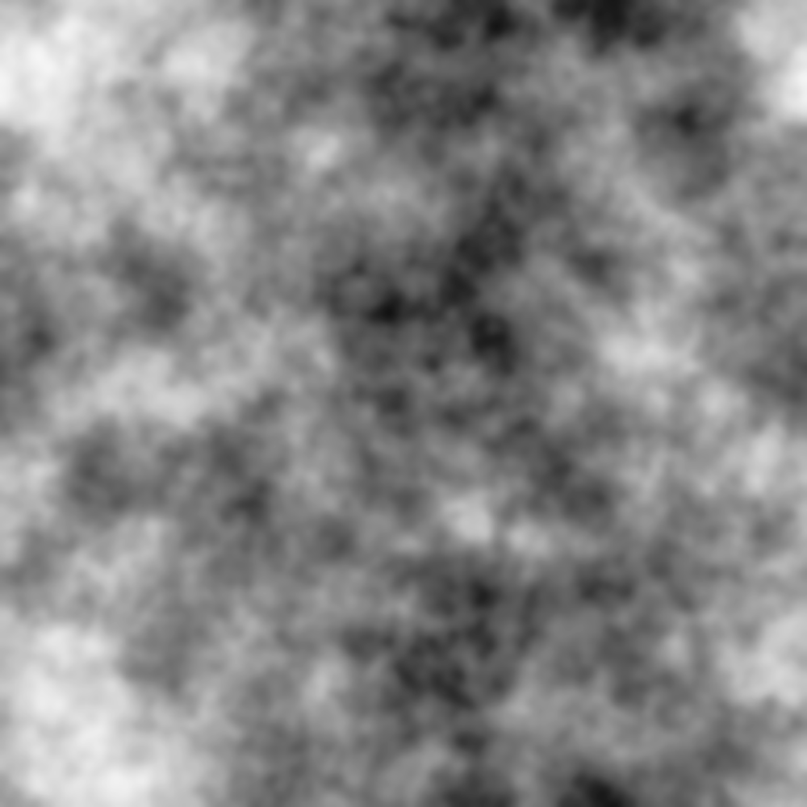

# Height map generator

Python script to generate a height map from a given power spectrum

It requires the following python packages: `numpy`, `scipy` `matplotlib` and [powerbox](https://pypi.org/project/powerbox/). You can install them with `pip install name-of-package`.

